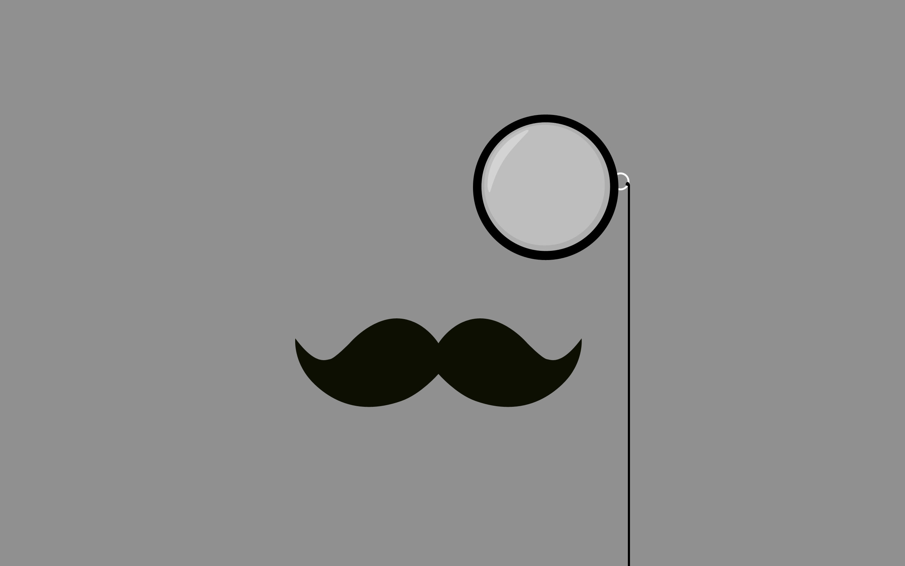

Monocle
=======

_An elegant solution to manage images_



## Table of content

- [The problem](#the-problem)
- [Our solution](#our-solution)
- [Examples](#examples)
- [Caching considerations](#caching-considerations)
- [Try it](#try-it)

## The problem

Dealing with images is a common requirement when putting a website together.

The _classic_ way to deal with large images is to create series of resized
images, and use the closest image in size on the frontend.

```html
 
 
 
 
```

results in this:


If the image place holder is too big for your resized image, you will end up
with a **pixelated** image, on the other end if it is too small, you will
**lose bandwidth**, and your loadtime will be impacted. This classic approach
is sub-optimal.

## Our solution

We think we have a better way to deal with images using _**live transformation and caching**_.

Instead of transforming images in advanced, and loading them using their hard coded names,
we ask monocle to load the original image from the source, and append
transformation parameters to the URL. This way you only need *one reference* to
the original image in your model and database, the transformation parameters
are choosen when implementing the frontend part of your website, there is no
need to guess in advance. The monocle approach is very agile in that sense.

## Examples

Assuming the Monocle service is running on `http://monocle.crowdtap.com/transform_image` we can do the following...

### Resize to 300px size...

```html
 
```


### Add a black and white filter and mirror...

```html
 
```


### Rotate by 45 degrees...

```html
 
```


### And more...

```html
 
```


### And more...

The list of transformation is here:

## Caching considerations

Resizing a given image over an over is very inefficient, hence the need for a
caching mechanism. Bear with me it is very simple to put a cache in place.

At Crowdtap we are using Cloudfront, the caching and CDN service from Amazon.

There is a small problem though, the query parameters are not taken into
consideration by most caching services, therefore we use an alternative URL
syntax to load the images from Monocle.

Instead of using query parameters:

```html
 
```

Hence the route is reorganized using a series of `param/value` where values are URL encoded:

```html
 
```

Now the route will be recorded by the cache. The next time a visitor hits that
route it will be served by the cache directly, and the Monocle backend service
will not be called.

## Try it!

```
http://magickly.jux.com/?src=https://github.com/crowdtap/monocle/raw/master/doc/images/monocle-man.jpg&resize=600&flop=true
```


